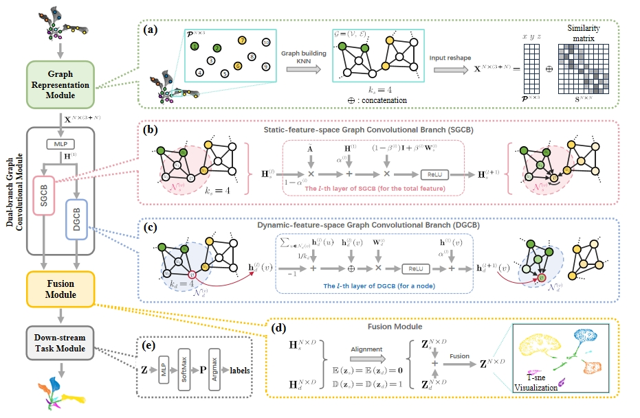

# DBGCN
This repo at __master branch__ contains the official codes for our paper:

### DBGCN: Dual-branch Graph Convolutional Network for organ instance inference on sparsely labeled 3D plant data
[Dawei Li](https://davidleepp.github.io/)[†](#myfootnote1), Zhaoyi Zhou[†](#myfootnote1), Si Yang and Weiliang Wen

<a name="myfootnote1">†</a> _Equal contribution_

---
## Acknowledgement
Part of our code was descended and modified from the open-source code by Ming Chen, Zhewei Wei and Zengfeng Huang, Bolin Ding and Yaliang Li. Their original code can be found at:  https://github.com/chennnM/GCNII.

Their related paper is as follows:
Chen, M., Wei, Z., Huang, Z., Ding, B., & Li, Y. (2020, November). Simple and deep graph convolutional networks. In International conference on machine learning (pp. 1725-1735). PMLR.

## Prerequisites
- Python == 3.7  
- Numpy == 1.24.4
- CUDA == 10.1
- pytorch == 1.7.1
- scikit-learn == 1.2.2
- scipy == 1.10.1
- pandas == 2.3.0
- linux

## Introduction

## Quick Start
The main open-source project can be divided into 3 steps.  
The source data PlantNet sub-dataset and Soybean-MVS sub-dataset used in the paper are provided in the folder [./source_data]  
The following is a complete process example using the Soybean-MVS sub-dataset as an example.  PlantNet sub-dataset or other point cloud datasets can be implemented according to the above process.  
### step1. build graph representation

### step2. build sparse labeling indexs

### step3. perform label propagating by DBGCN model

## Citation
