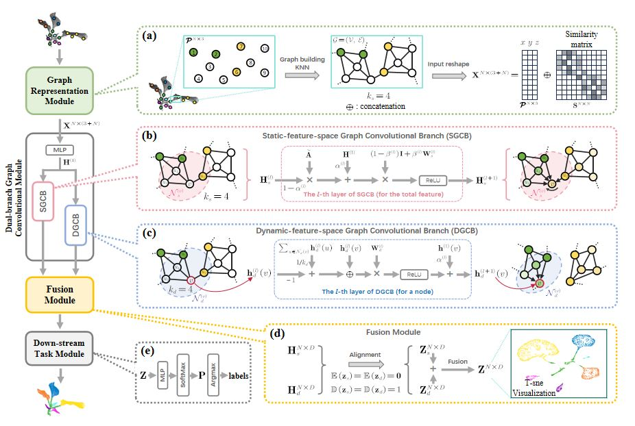

# DBGCN
This repo contains the official codes for our paper:

### DBGCN: Dual-branch Graph Convolutional Network for organ instance inference on sparsely labeled 3D plant data
[Dawei Li](https://davidleepp.github.io/)<sup>[†](#myfootnote1)</sup>, Zhaoyi Zhou<sup>[†](#myfootnote1)</sup>, Si Yang and Weiliang Wen

<a name="myfootnote1">†</a> _Equal contribution_

---
## Acknowledgement
Part of our code was descended and modified from the open-source code by Ming Chen, Zhewei Wei and Zengfeng Huang, Bolin Ding and Yaliang Li. Their original code can be found at:  https://github.com/chennnM/GCNII.

Their related paper is as follows:
Chen, M., Wei, Z., Huang, Z., Ding, B., & Li, Y. (2020, November). Simple and deep graph convolutional networks. In International conference on machine learning (pp. 1725-1735). PMLR.

## Prerequisites
- Python == 3.7  
- Numpy == 1.24.4
- CUDA == 10.1
- pytorch == 1.7.1
- scikit-learn == 1.2.2
- scipy == 1.10.1
- pandas == 2.3.0

## Introduction




## Quick Start
The main open-source project working on Linux can be divided into 3 steps.  
Partial source data sampled by FPS from the paper provided in the folder [./source_data], there are __PlantNet sub-dataset__  and __Soybean-MVS sub-dataset__ respectively.  
The original point cloud data format is [x, y, z, labels], x,y adn z represent XYZ coordinates.   
This project gives executable examples in the folder [./examples].
### step1. build graph representation
The labeled point cloud data is processed as the input of GCN network, and the adjacency matrix and graph feature CSV file are output.  
Please specify the super parameter before executing the [build_graph_representation.py],  
including --source_data --Knum --adj_store_fold --content_store_fold.
```
python build_graph_representation.py
```
After processing, you will see the adjacency matrix with '.txt' as suffix is stored in the [./examples/adj_store_fold], 
and the graph feature matrix with '.csv' as suffix is stored in the [./examples/content_store_fold].

### step2. build sparse labeling indexs
Calculate the index of the training point set in the point cloud,
simulate the random labeling strategy and extreme labeling strategy of manual annotation.  
Please specify the super parameter before executing the [build_sparse_labeling.py],  
including --source_data, --is_RS, --trainidx_store_fold, --trainNum.  
It is worth noting that if the 'is_RS' parameter is True, the independent random labeling strategy will be executed for 5 times, while the extreme strategy will be executed if 'is_RS' parameter is False. 
```
python build_sparse_labeling.py
```
You will see the sparse labeling indexs generated by random labeling strategy stored in the [./examples/RS_train_idx].

### step3. perform label propagating by DBGCN model
Perform inference and training on plant point clouds with sparsely annotated organ labels,
automatically propagating the labels to all points in the point cloud, and conduct label propagation accuracy evaluation.  
Please specify the super parameter before executing the [DBGCN_main.py]  
There are several parameters that need to be changed frequently,  
they are --hidden, --trainNum, --idx, --ks, --kd, --adj_folder, --content_folder, --result_folder.
```
python DBGCN_main.py
```
Read adjacency matrix and graph feature data from [./examples] folder,  
output test accuracy, average test accuracy, running time and logs in the [./examples/results] folder.

## Citation
